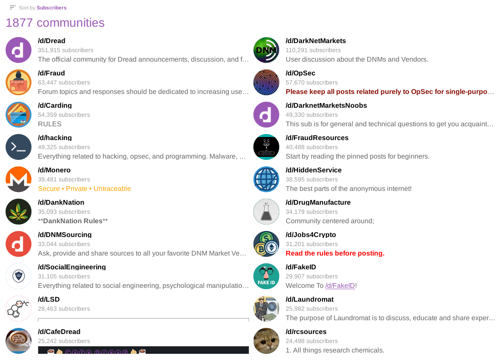

Note: These notes are extremely corny and I would not recommend reading them. I just have them down here so I can reference back when I get off of EVE long enough to actually write this thing.  
  
Remember kids, it's a hobby, not an addiction. 

# Deep web vs Dark web

"The deep web is defined as the internet section that is not indexed by web crawlers. The dark web, on the other hand, is defined as a subsegment of the deep web that can be accessed only with special tools. While the former is used chiefly for legitimate day-to-day online activities, the latter is more anonymous and known for illegal transactions."

https://www.spiceworks.com/it-security/security-general/articles/dark-web-vs-deep-web/

# Brief history

  
https://www.soscanhelp.com/blog/history-of-the-dark-web  

Freenet was created in 2000 by a university student at the University of Edinburgh named Ian Clarke. The goal of Freenet was to be a "Distributed Decentralised Information Storage and Retrieval System" (geek talk for Internet). This was used as the base for the Tor Project which came around in 2002 and is generally what people think of when they hear the words "Dark web".  

https://sopa.tulane.edu/blog/everything-you-should-know-about-dark-web  

# Accessing the dark web

There are a few different versions of the dark web however the most famous is Tor. Accessing Tor is as simple as downloading the Tor Browser and installing it to your computer. From there, you can access sites on the Tor network. Other dark webs such as I2P require their own browsers and protocols to access.  

https://www.torproject.org/

# What to expect?

If you don't know what you are looking for? Not a lot. If you know what you are looking for, then you know what to expect. The dark web is just another internet and as such, it's not too far off of what you would imagine goes on that you can see.  

# Tourist attractions

Dark.fail  
https://dark.fail/  
darkfailenbsdla5mal2mxn2uz66od5vtzd5qozslagrfzachha3f3id.onion  
  
Dark.fail is known as a highly reputable link site for the dark web. It contains links to 34 different sites ranging from mirrors of government websites to Reddit clones to legal XXX material (maybe don't include that part?).   

Dread  
http://dreadytofatroptsdj6io7l3xptbet6onoyno2yv7jicoxknyazubrad.onion   
http://g66ol3eb5ujdckzqqfmjsbpdjufmjd5nsgdipvxmsh7rckzlhywlzlqd.onion  

Dread is one of the most famous sites on the Dark web. In essence, it is a Reddit clone that can be used for discussion of almost anything. The only things that are not allowed to be discussed are:  
- **
- Pro-terrorism or terrorist propaganda
- Harmful weapons/weapons of mass destruction
- Poisons
- Assassination services or media related to harm/murder
- Doxxing

Despite the potential for a lot of very nasty discussion to go on with the minimal moderation stance the staff takes, I saw next to none of what most would call "unacceptable behavior". Most users were very civil and having discussions on topics that interested them or they wanted more info on.  

Dread is also the #1 place on the dark web to advertise your criminal goods and services (Note that nothing is permitted to be sold directly on Dread), however we will get back to that.  

  
Distributed Denial of Secrets  
https://ddosecrets.com/wiki/Distributed_Denial_of_Secrets   
http://ddosxlvzzow7scc7egy75gpke54hgbg2frahxzaw6qq5osnzm7wistid.onion/wiki/Distributed_Denial_of_Secrets  

Distributed Denial of Secrets is a website known for hosting internet leaks. These range from drug busts to the no fly list. While the site itself is legal for the most part, it does have a TOR site for the paranoid.  

The Official CIA Website (no I am not joking)  
https://cia.gov/  
http://ciadotgov4sjwlzihbbgxnqg3xiyrg7so2r2o3lt5wz5ypk4sxyjstad.onion/  

The CIA hosts a TOR site for cia.gov. The primary use case for this is as an anonymous reporting.  

# Economy

Almost all economic transactions that take place on the dark web cannot use real currency. This is due to the obvious security issues that come with using a FIAT payment processor for potentially illegal things when you are trying to remain as anonymous as possible. In current year, the most used form of payment on the Dark Web is a cryptocurrency called Monero. In simple terms, Monero is what most people think Bitcoin is. It is fully anonymous and uses many different security features to ensure that transactions are not tracable.  
  
Note that Monero was NOT explicitly made for the purpose of illict transactions. It was made as a privacy tool. However, there is a significant overlap between the privacy community and people who need to stay private for more nefarious reasons.   

# Criminal Uses 

If you are trying to break the law with drugs, fraud, or other assorted means, the Dark Web is probably the most secure place to be doing so.  
  
Before continuing, I must stress that ***no one on our team condones criminal activity of any kind.*** Please consult your local laws before doing something you could regret.

While The Silk Road may have shut down years ago, drug marketplaces are still alive, well, and more secure than ever before. Sites such as A*** aim to be a "dark web Amazon" and try to make it as easy as possible to order illicit substances.  
  

  
Most advertising for drug related products happen on the appropriate subdread back on Dread. Many vendors will post their offerings on Dread to try and garner sales and the good will of the people.

Dread is also where a lot of people will share advice regarding various types of crime. Popular non-drug related crime discussions are hacking, fraud, money laundering, and social engineering.

# Non-criminal uses

Reporting crime, accessing video content you have purchased prior, and evading censorship. 